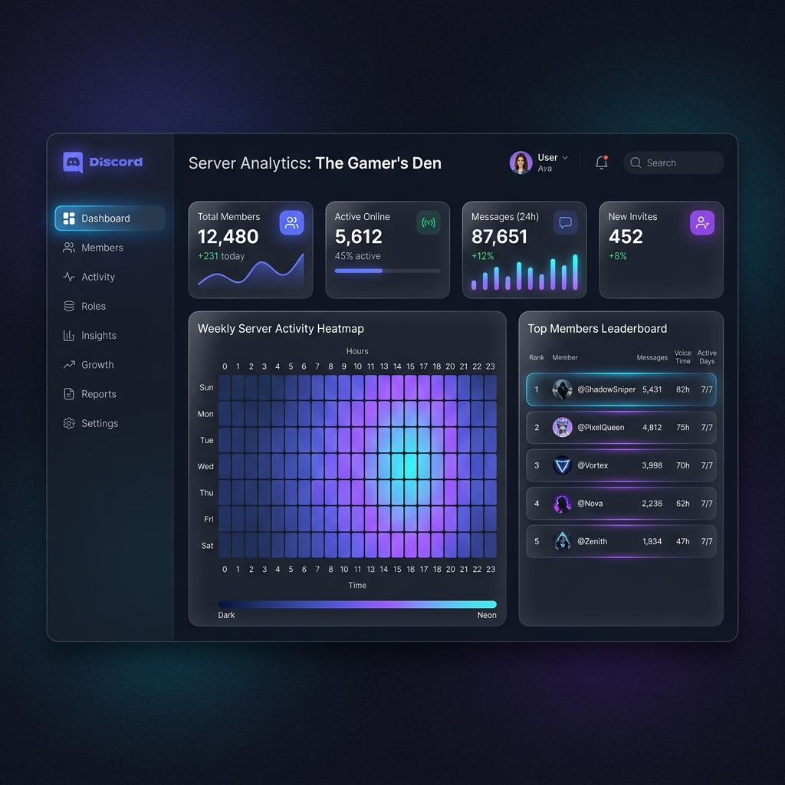

<div align="center">
  
  <h1>DiscordDash</h1>
  <p><strong>A Modern, Premium Dashboard for Real-Time Discord Server Analytics</strong></p>

  [](https://nextjs.org/)
  [](https://nodejs.org/)
  [](https://discord.js.org/)
  [](https://www.prisma.io/)
  [](https://tailwindcss.com/)
</div>

---

## 🎨 Dashboard Preview


*A conceptual look at the modern, premium dark-mode interface of DiscordDash.*

---

## 📖 Overview

**DiscordDash** is an elegant, full-stack web application designed to visualize Discord server statistics in real-time. It provides server owners and admins with a comprehensive look at their community's health, including member activity, most active channels, server growth charts, and top user leaderboards.

The project is structured as a **Monorepo** consisting of two main components:
1. **Discord Bot (`discorddash-bot`)**: A lightweight Node.js data collector that listens to server events 24/7 without logging any sensitive message contents (strictly metadata only).
2. **Web Dashboard (`discorddash-web`)**: A stunning frontend and API backend powered by Next.js 15, styled with Tailwind CSS v4 and Shadcn UI.

---

## ✨ Key Features

- **📊 Member Statistics**: Track total members, track daily/weekly growth with beautiful area charts, and monitor join vs. leave metrics.
- **💬 Channel Activity Heatmaps**: Discover your most active channels and peak activity hours natively visualized via Recharts.
- **🏆 User Leaderboards**: Showcase the top 10 most active members to drive engagement.
- **📈 Server Overview**: A clean summary of total channels, roles, real-time online members, and a 7-day activity snapshot.
- **🔒 Privacy First**: We value your community's privacy. **No message content is ever saved to our databases**, only non-identifying metadata (timestamps, channel IDs).

---

## 🛠️ Tech Stack

### Web Application (`discorddash-web`)
- **Framework**: [Next.js 15](https://nextjs.org/) (App Router)
- **Styling**: [Tailwind CSS v4](https://tailwindcss.com/) + [Shadcn UI](https://ui.shadcn.com/)
- **Authentication**: [NextAuth.js v5](https://next-auth.js.org/) (Discord OAuth2 Provider)
- **Database**: [PostgreSQL](https://www.postgresql.org/) (via [Supabase](https://supabase.com/))
- **ORM**: [Prisma v7](https://www.prisma.io/)
- **Charts**: [Recharts](https://recharts.org/)

### Data Collector (`discorddash-bot`)
- **Runtime**: [Node.js 22 LTS](https://nodejs.org/)
- **Library**: [Discord.js v14](https://discord.js.org/)
- **Language**: TypeScript

---

## 🚀 Getting Started

Follow these steps to set up the project locally.

### Prerequisites
- Node.js 22+
- PostgreSQL Database URL (e.g., Supabase)
- A Discord Application (Bot Token, Client ID, Client Secret)

### 1. Clone the repository
```bash
git clone https://github.com/Sendyawldn/discorddash.git
cd discorddash
```

### 2. Configure Environment Variables
Navigate into both the bot and web directories and create `.env` files based on the provided `.env.example`.

### 3. Setup the Web Dashboard
```bash
cd discorddash-web
npm install
npx prisma db push # or npx prisma migrate dev
npm run dev
```
The dashboard will be available at `http://localhost:3000`.

### 4. Run the Discord Bot
```bash
cd discorddash-bot
npm install
npm run dev
```

---

## 📜 Data Privacy Notice
This project strictly adheres to data privacy guidelines. The bot requires the `MESSAGE CONTENT INTENT` solely for analytical metrics (like message counting), but the content of the messages themselves is intentionally omitted from our database schema.

---

<div align="center">
  <i>Built with ❤️ for the Discord community.</i>
</div>
